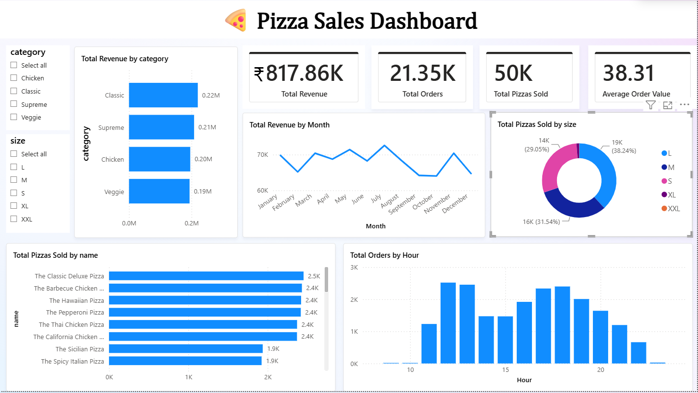
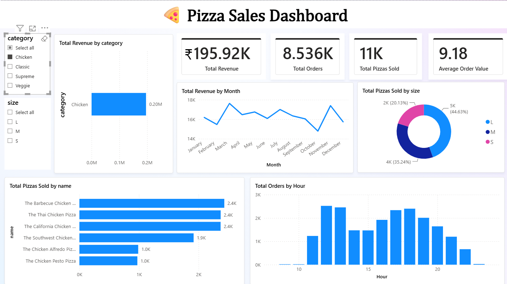
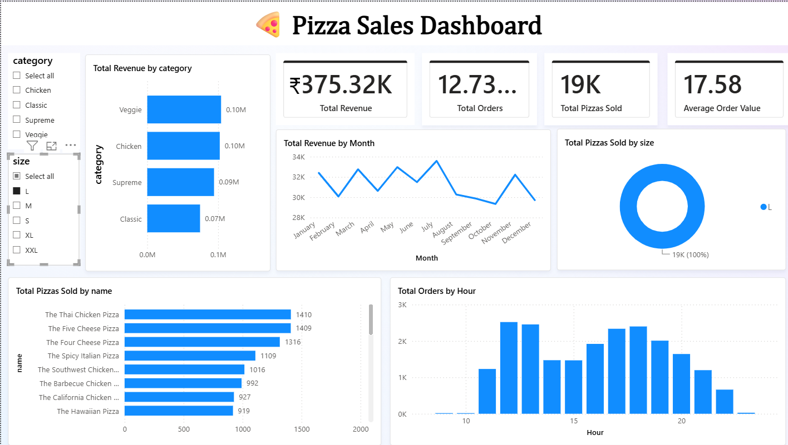

# 🍕 Pizza Sales Analysis using SQL & Power BI

## 📌 Project Overview

This project analyzes pizza sales data using SQL and Power BI to identify business insights, revenue trends, customer behavior, and product performance.

## 🛠 Tech Stack

- MySQL
- SQL
- Power BI

## 📂 Dataset

- orders.csv
- order_details.csv
- pizzas.csv
- pizza_types.csv

## 📊 Dashboard

## 📈 Dashboard Filters

### Category Filter

### Size Filter

## 🚀 Skills Demonstrated

- SQL Joins
- Aggregate Functions
- Window Functions
- CTEs
- Data Visualization
- Power BI